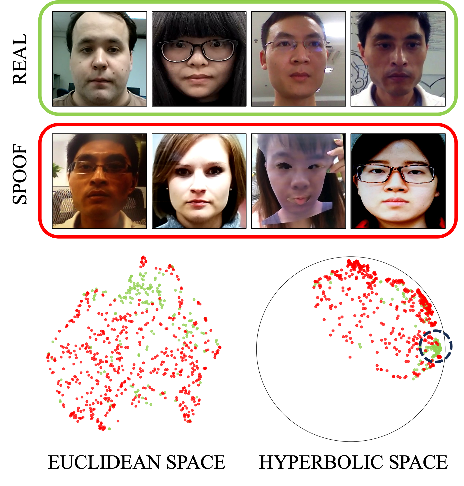
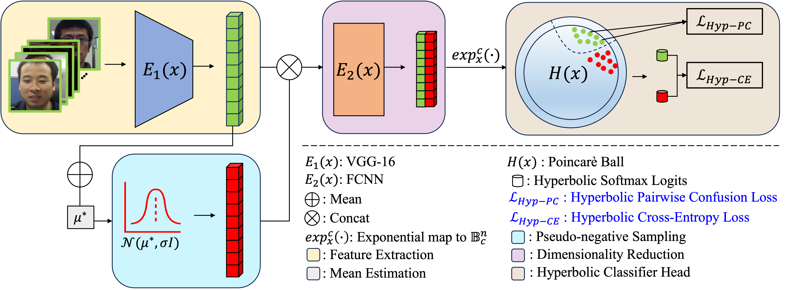

<div align="center">

# Hyp-OC : Hyperbolic One Class Classification for Face Anti-Spoofing [FG 2024]

[Kartik Narayan](https://kartik-3004.github.io/portfolio/) &emsp; [Vishal M. Patel](https://engineering.jhu.edu/faculty/vishal-patel/)  

Johns Hopkins University

<a href=''></a>
<a href=''></a>
<a href=''></a>

</div>

Official implementation of **[Hyp-OC : Hyperbolic One Class Classification for Face Anti-Spoofing]()**.
<hr />

## Highlights

Hyp-OC, is the first work exploring hyperbolic embeddings for one-class face anti-spoofing (OC-FAS).

1️⃣ We show that using hyperbolic space helps learn a better decision boundary than the Euclidean counterpart, boosting one-class face anti-spoofing performance.<br>
2️⃣ We propose Hyperbolic Pairwise Confusion Loss (Hyp-PC), that operates on the hyperbolic space inducing confusion within the hyperbolic feature space,
effectively stripping away identity information. Such disruption of features helps to learn better feature representations for the FAS task.<br>
3️⃣ We provide a hyperbolic formation of cross-entropy loss (Hyp-CE), that uses hyperbolic softmax logits and penalizes the network for every misclassification.<br>

<p align="center" width="100%">
  
</p>

> **<p align="justify"> Abstract:** *Face recognition technology has become an integral part of modern security systems
> and user authentication processes. However, these systems are vulnerable to spoofing attacks and can easily be circumvented.
> Most prior research in face anti-spoofing (FAS) approaches it as a two-class classification task where models are trained
> on real samples and known spoof attacks and tested for detection performance on unknown spoof attacks. However, in practice,
> FAS should be treated as a one-class classification task where, while training, one cannot assume any knowledge regarding
> the spoof samples a priori. In this paper, we reformulate the face anti-spoofing task from a one-class perspective and
> propose a novel hyperbolic one-class classification framework. To train our network, we use a pseudo-negative class sampled
> from the Gaussian distribution with a weighted running mean and propose two novel loss functions: (1) Hyp-PC: Hyperbolic
> Pairwise Confusion loss, and (2) Hyp-CE: Hyperbolic Cross Entropy loss, which operate in the hyperbolic space. Additionally,
> we employ Euclidean feature clipping and gradient clipping to stabilize the training in the hyperbolic space. To the best of
> our knowledge, this is the first work extending hyperbolic embeddings for face anti-spoofing in a one-class manner. With
> extensive experiments on five benchmark datasets: Rose-Youtu, MSU-MFSD, CASIA-MFSD, Idiap Replay-Attack, and OULU-NPU, we
> demonstrate that our method significantly outperforms the state-of-the-art, achieving better spoof detection performance.* </p>

# :rocket: News
- [04/20/2024] 🔥 We release Hyp-OC.

# Framework
<p align="center" width="100%">
  
</p>
Overview of the proposed pipeline: Hyp-OC. The encoder extracts facial features which are used to estimate the mean of Gaussian 
distribution utilized to sample pseudo-negative points. The real features and pseudo-negative features are then concatenated 
and passed to FCNN for dimensionality reduction. The low-dimension features are mapped to Poincaré Ball using *exponential map*. 
The training objective is to minimize the summation of the proposed loss functions Hyp-PC and Hyp-CE. The result is a separating 
*gyroplane* beneficial for one-class face anti-spoofing.


# Installation
```bash
conda env create --file environment.yml
conda activate hypoc
```

# Download Data
The datasets can be downloaded from their respective webpages or by mailing the authors:<br>
1. [Idiap Replay Attack](https://www.idiap.ch/en/scientific-research/data/replayattack)<br>
2. [MSU MFSD](https://sites.google.com/site/huhanhomepage/datasetcode)<br>
3. [CASIA MFSD](https://ieeexplore.ieee.org/document/6199754)<br>
4. [OULU-NPU](https://sites.google.com/site/oulunpudatabase/)<br>
5. [ROSEYoutu](https://rose1.ntu.edu.sg/dataset/faceLivenessDetection/)<br>

Arrange the dataset in the following manner:
```python
.
├── datasets
│   ├── ReplayAttack
│   │   ├── train_frames
│   │   ├── test_frames
│   │   ├── devel_frames
│   ├── MSU MFSD
│   │   ├── train
│   │   ├── test
│   ├── CASIA MFSD
│   │   ├── train
│   │   ├── test
│   ├── OULU_NPU
│   │   ├── Train_frames
│   │   ├── Test_frames
│   │   ├── Dev_frames
│   │   ├── Protocols
│   ├── ROSEYoutu
│   │   ├── client
│   │   │   ├── rgb
│   │   │   │   ├── adaptation
│   │   │   │   ├── test
```
NOTE: The train, test and eval splits are provided in the /data/ folder.

# Download Pre-trained weights
The pre-traind model can be downloaded manually from [HuggingFace](https://huggingface.co/kartiknarayan/hyp-oc) or using python:
```python
from huggingface_hub import hf_hub_download

hf_hub_download(repo_id="kartiknarayan/hyp-oc", filename="pretrained_weights/vgg_face_dag.pth", local_dir="./")
```
The directory structure should finally be:

```
  . ── hyp-oc ──┌── pretrained_weights/vgg_face_dag.pth
                ├── data
                ├── hyptorch
                ├── config.py
                ├── dataloader.py
                ├── loss.py
                ├── models.py
                ├── statistics.py
                ├── train.py
                ├── test.py
                └── utils.py                    
```

# Usage
Download the pre-trained weights from [HuggingFace](https://huggingface.co/kartiknarayan/hyp-oc) and ensure the directory structure is correct.<br>

### Training
```python
  python train.py \
      --expt_name roseyoutu \
      --dataset ROSEYoutu \
      --device 0 \
      --epochs 60 \
      --batch_size_train 8 \
      --batch_size_val 128 \
      --val_check_after_epoch 1 \
      --save_for_each_val_epoch True \
      --optim_lr 1e-6 \
      --optim_weight_decay 1e-6 \
      --std_dev 1 \
      --feature_dimension 4096 \
      --alpha 0.8 \
      --curvature 0.1

# -- dataset = [ROSEYoutu, ReplayAttack, CASIA_MFSD, MSU_MFSD, OULU_NPU, OCI, OMI, OCM, ICM]
```
The trained models are stored in the specified "save_root".<br>
The training logs can be seen at "log_root"

### Inference
```python
python test.py \
    --source_dataset ReplayAttack \
    --target_dataset MSU_MFSD \
    --device 0 \
    --curvature 0.1 \
    --batch_size_test 32 \
    --list replayattack
```
--list contains "," separated experiment names performed on the --source_dataset.

## Citation
If you find Hyp-OC useful for your research, please consider citing us:

```bibtex
Coming Soon ...
```
## Acknowledgement
The hyptorch module of the code is taken from [hyp_metric](https://github.com/htdt/hyp_metric) repository. We thank the authors for the same.

## Contact
If you have any questions, please create an issue on this repository or contact at knaraya4@jhu.edu
